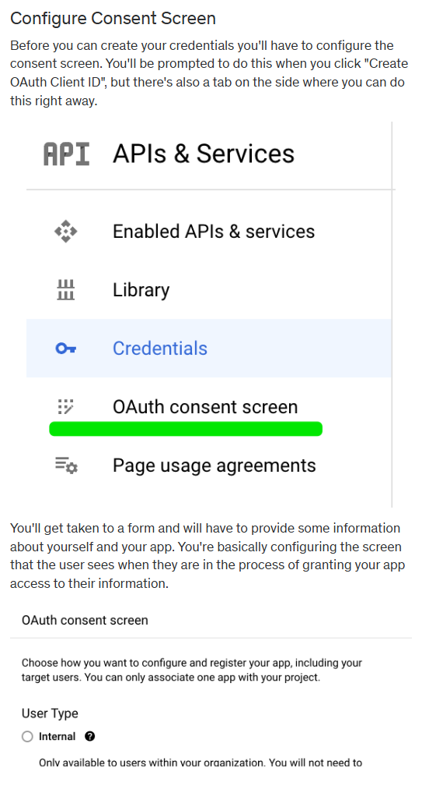
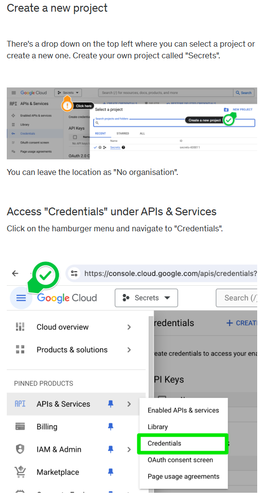
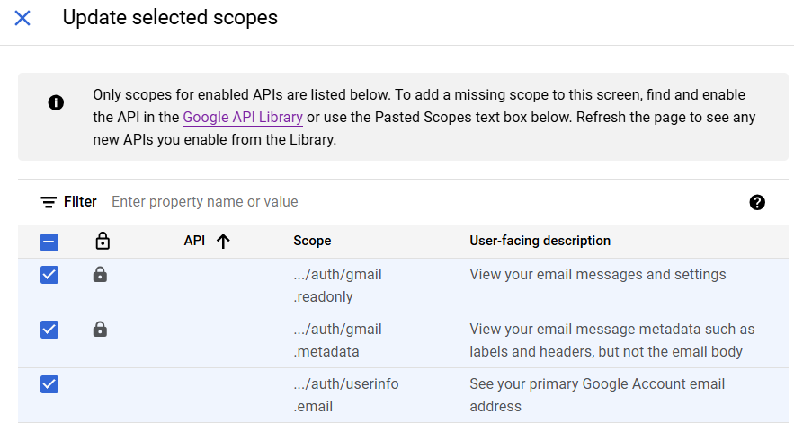
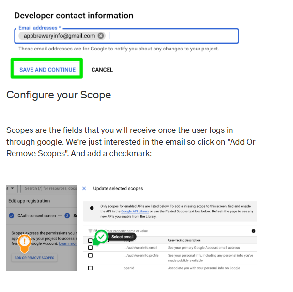
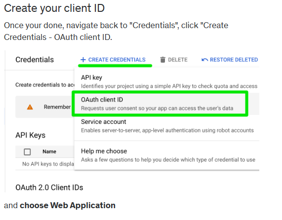
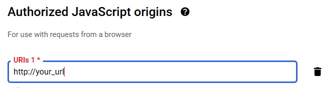
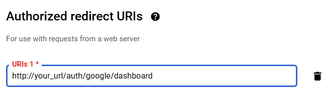
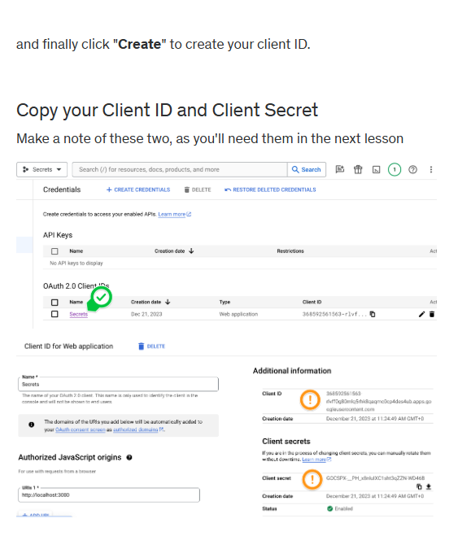

# Submission Tracker Installation Guide

This guide will walk you through installing the **Submission Tracker** application on a Linux server without `sudo` access. The application requires **Node.js** and **PostgreSQL**.
## Be in the root directory when you start.

## Step 1: Install Node.js (Without `sudo` Access)

1. **Download and Install Node.js Locally**:
      ```bash
      wget https://nodejs.org/dist/v16.20.0/node-v16.20.0-linux-x64.tar.xz
      tar -xvf node-v16.20.0-linux-x64.tar.xz -C ~/nodejs
      echo 'export PATH=$HOME/nodejs/node-v16.20.0-linux-x64/bin:$PATH' >> ~/.bashrc
      source ~/.bashrc
      cd app
      npm i
      cd ..
      ```

## Step 2: Install PostgreSQL (Without `sudo` Access)

### modify name and email_id of the user

```bash
   wget https://ftp.postgresql.org/pub/source/v15.3/postgresql-15.3.tar.gz
   tar -xzf postgresql-15.3.tar.gz
   cd postgresql-15.3
   ./configure --prefix=$HOME/pg
   make
   make install
   export PATH=$HOME/pg/bin:$PATH
   echo 'export PATH=$HOME/pgsql/bin:$PATH' >> ~/.bashrc
   source ~/.bashrc  
   initdb -D $HOME/pg/data
   psql -h $HOME/pg/tmp -U prabal2022357 -d postgres
  CREATE DATABASE rema_db;
  \q 
  psql -h $HOME/pg/tmp -U prabal2022357 -d rema_db
  \i /home/prabal2022357/app/SQL/Database_schemas.sql
  INSERT INTO admin(name, email_id) VALUES ('name', 'email_id');
  \q
  cd ../app  
   ```
## Step 3: configure API

1. Navigate to https://console.cloud.google.com/ and sign in with your Google/gmail account.
  

## Select internal over here



Enable the Gmail API by going in the Library section



Go to data Access tab, and add these scopes to the app.








Be sure to add these









## Step 4: Modify .env
1. rename sample.env to .env
2. your .env looks like this, modify the values of GOOGLE_CLIENT_ID, GOOGLE_CLIENT_SECRET,SSH_id, your_ssh_password, your_url
```env
GOOGLE_CLIENT_ID="your_client_id"
GOOGLE_CLIENT_SECRET="your_secret_key"
PG_USER="SSH_id"
PG_HOST="localhost"  
PG_DATABASE="rema_db"
PG_PASSWORD="your_ssh_password"
PG_PORT="5432"
BASE_URL ="your_url"
   ```

## Step 5: Run the Application

1. **Start the Application**:

   Once the dependencies are installed and environment variables are set, start the application and move in the background using:

   ```bash
    nohup node index.js & disown
    ```

2. **Access the Application**:

   The server should now be running. You can access the application by navigating to `http://your_url` in your web browser.
