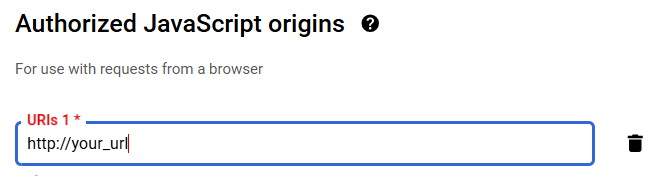
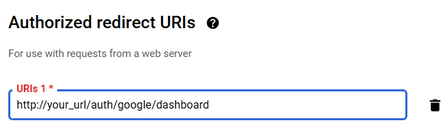
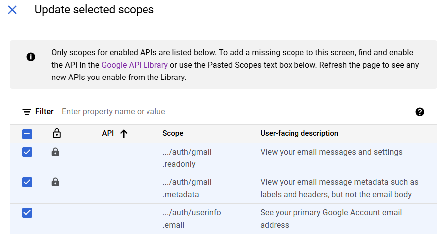
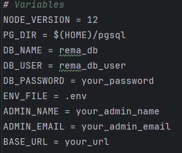

# Submission Tracker Installation Guide

This guide will walk you through installing the **Submission Tracker** application on a Linux server without `sudo` access. The application requires **Node.js** and **PostgreSQL**.

## Step 1: Install Node.js (Without `sudo` Access)

1. **Download and Install Node.js Locally**:
    - First, install **NVM** (Node Version Manager) by running the following commands:

      ```bash
      curl -o- https://raw.githubusercontent.com/nvm-sh/nvm/v0.39.3/install.sh | bash
      ```

    - After installation, close and reopen your terminal, or run:

      ```bash
      source ~/.bashrc
      ```

    - Install the desired version of Node.js using NVM (e.g., the latest LTS version):

      ```bash
      nvm install 12
      ```

2. **Verify Node.js and NPM Installation**:

   Check if Node.js and npm (Node Package Manager) are installed:

   ```bash
   node -v
   npm -v
   ```

   This should output the installed versions of Node.js and npm.

   set Node.js version 12 as the default version when you open new terminals as the IIITD servers are outdated.
   ```
   nvm use 12
   nvm alias default 12
   ```

## Step 2: Install PostgreSQL (Without `sudo` Access)

To install PostgreSQL without `sudo`, you can install it locally using a pre-built binary or compile it from source. For simplicity, we’ll use a pre-built binary.

1. **Download PostgreSQL**:

   Go to the [PostgreSQL download page](https://www.postgresql.org/download/) and download the appropriate version for your system. For Linux, you can use the following commands:

   ```bash
   wget https://get.enterprisedb.com/postgresql/postgresql-13.3-2-linux-x64-binaries.tar.gz
   ```

   Replace `13.3` with the version you need.

2. **Extract the Archive**:

   Extract the downloaded archive to a directory in your home folder:

   ```bash
   tar -xvzf postgresql-13.3-2-linux-x64-binaries.tar.gz
   mv pgsql /home/your-username/
   ```

   Replace `your-username` with your actual username or the path where you want to install PostgreSQL.

3. **Set Environment Variables for PostgreSQL**:

   Add the PostgreSQL binary path to your `PATH` variable so that you can use PostgreSQL commands directly from the terminal:

   ```bash
   echo 'export PATH=$HOME/pgsql/bin:$PATH' >> ~/.bashrc
   source ~/.bashrc
   ```

4. **Start PostgreSQL Locally**:

   To start PostgreSQL, use the following command (it runs the server in the background):

   ```bash
   pg_ctl -D $HOME/pgsql/data start
   ```

    - To stop PostgreSQL:

      ```bash
      pg_ctl -D $HOME/pgsql/data stop
      ```

5. **Initialize the Database**:

   Before you can use PostgreSQL, initialize the database:

   ```bash
   initdb -D $HOME/pgsql/data
   ```

6. **Create a Database and User**:

   Run the following commands to create a user and a database for the application:

   ```bash
   createuser rema_db_user
   createdb rema_db
   ```

   ```bash
   psql -c "ALTER USER rema_db_user WITH PASSWORD 'your_password';"
   ```

   Replace `'your_password'` with a secure password for the `rema_db_user`.

   To access the database:
   ``` 
   cd pgsql/bin
   ./psql -U postgres -d remadb
   ```

   After this input the data schemas given in the SQL files.
7. input the admin details using

   ```
   INSERT INTO admin(name,email_id) VALUES ('name','email_id');
   ```
8. 
   quit using
   ```
   \q
   ```

## Step 3 (if you havent downloaded the full folder already): Clone the Repository

1. **Clone the Project Repository**:

   Clone the **Submission Tracker** repository from GitHub:

   ```bash
   git clone https://github.com/shrutya22487/Submission_Tracker.git
   cd Submission_Tracker
   ```

## Step 4: Install Project Dependencies

1. **Install Node.js Dependencies**:

   Run the following command to install the required Node.js dependencies:

   ```bash
   npm install
   ```

## Step 5: configure API
Refer to this video

```
https://www.youtube.com/watch?v=I5ili_1G0Vk&t=550s
```

Be sure to add these



Enable the Gmail API by going in the Library section

Go to data Access tab, and add these scopes to the app.


## Step 6: Configure the Application

1. **Set Up Environment Variables**:

   Create a `.env` file in the project root directory:

   ```bash
   touch .env
   ```

   Add the following configuration to the `.env` file, replacing the placeholder values with your actual PostgreSQL credentials:

   ```env
   GOOGLE_CLIENT_ID="your_client_id"
    GOOGLE_CLIENT_SECRET="your_secret_key"
    PG_USER="rema_db_user"
    PG_HOST="localhost"  
    PG_DATABASE="rema_db" 
    PG_PASSWORD="your_password"
    PG_PORT="5432" 
    BASE_URL ="your_url"
   ```
   Replace `'your_password'` with a secure password for the `rema_db_user`, `'your_clinet_id'` , `'your_secret_key'` ,`'rema_db'` and `'your_url'` as per your choice.

## Step 7: Run the Application

1. **Start the Application**:

   Once the dependencies are installed and environment variables are set, start the application and move in the background using:

   ```bash
    nohup node index.js & disown
    ```

2. **Access the Application**:

   The server should now be running. You can access the application by navigating to `http://your_url` in your web browser.

# Alternatively: Use the makefile

1. First configure the Google API keys as shown above

2. configure these values : DB_PASSWORD,ADMIN_NAME. ADMIN_EMAIL BASE_URL
3. 
4. run ```make```
5. do step 7 (above) to start the application.